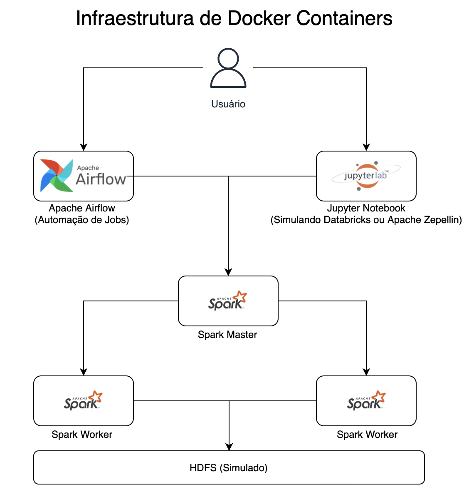
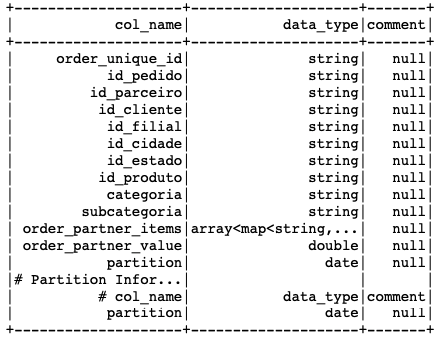
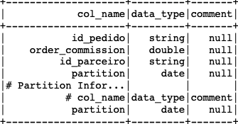
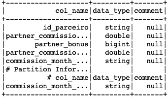
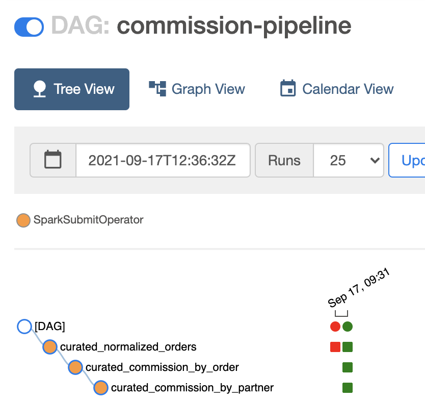

# Case Magalu

Esse repositório contém a resolução do case proposto pela Luizalabs. Abaixo se encontram
explicações breves dos principais diretórios e arquivos desse repositório.

- Airflow Spark Docker: Diretório que contém os arquivos necessários (Dockerfile e dependências) para criar o container 
  com o Airflow
- DAGs: Script das DAGs que vão ser criadas no Airflow
- hdfs: Diretório que simula um hdfs entre todos os containers do docker
  - Data: Diretório contendo os dados iniciais fornecidos pela Luizalabs
  - magaluTools: Pacote Python desenvolvido para facilitar nas extrações, contém validadores de dados, loggers e funções de
    auxílio na etl inicial
  - Notebooks: Diretório contendo os Notebooks Jupyter para utilizar o spark dinamicamente
  - Scripts: Versões .py dos Notebooks Jupyter, utilizados no Airflow para que ele consiga submeter spark jobs para o cluster
  - Warehouse: Local onde estarão os dados do Warehouse criado pelo Airflow ou pelo jupyter
  - dump_metadata: Arquivo chave que contém informações importantes de como as extrações dos arquivos csv vão ser realizadas.
    (Validações, particionamentos do dataset e o delimitador do csv)
- SparkEnviron: Diretório com os DockerFiles de spark master e workers


## Infraestrutura



A infraestrutura foi baseada em um ecossistema real que pode existir na cloud. O Jupyter e os notebooks podem ser usados,
por analistas de dados, analistas de negócio e outros usuários para ter acesso democrático aos dados contidos no warehouse.
Bem como fazer as suas próprias ETLs, integrações e análises.

O Airflow é o agendador de jobs, então por exemplo, nesse case que o desafio é montar um relatório automatizado de comissões,
acabei agendando um job que roda no primeiro dia de cada mês, assim, todos os meses teremos a base de dados do relatório
sempre atualizada quando necessária. 

O Warehouse foi desenvolvido no modelo de arquivos, utilizando o Hive embbeded do Spark como catalogador dos dados, sendo
possível utilizar o spark SQL para acessar os dados de maneira mais fácil e democrática entre as unidades de negócio.

### Pré Requisitos

- Docker e Docker Compose
- 6GB livres para o docker
  - [**Atenção**] Dependendo da sua configuração do docker, ele pode estar limitado a utilizar menos memória do que 6GB.
  - Avalie a necessidade de aumentar a configuração de memória nas suas configurações do docker!

## O Warehouse
O Warehouse foi desenvolvido pensando na escalabilidade do modelo. Temos duas zonas: raw e curated. A zona raw foi pensada 
na leitura rápida dos dados, não possui nenhum filtro, os dados são apenas salvos e particionados* no formato de parquet**.
Já na curated, os dados são criados através dos notebooks de etl ou dos jobs do Airflow com pyspark jobs. Nesse modelo, 
analistas podem utilizar os dados curados, que serão os dados que já estão modelados para o seu uso específico nas unidades
de negócio. E se caso necessitem de mais informações, podem acessar o ambiente raw para formular novos datasets personalizados
para o seu uso.


*Arquivos particionados corretamente permitem uma maior eficiência no carregamento de grandes volumes de dados e eficiência
nos custos do warehouse, com apenas os dados necessário trafegados. Além também de permitir um modelo escalável, conforme mais
dados são armazenados. As partições também permitem sobrescrever os dados do datalake e permitir o reprocessamente de uma
partição específica caso seja necessária a correção de algum dado ou adição de dados complementares, não sendo necessário
sobrescrever todo o dataset.

**Os dados foram salvos no warehouse no formato de parquet por alguns motivos. É um formato colunar que permite a rápida
aquisição apenas das colunas que vão ser utilizadas, diminuindo o tráfego de dados e aumentando a eficiência de custos,
permitindo a escalabilidade do warehouse.

### Schemas e lógicas das tabelas curadas

Obs: Todas as tabelas curadas foram particionadas pela data do pedido

- Normalized Orders:



Essa tabela foi pensada como ponto de início, contém os pedidos normalizados com os seus respectivos itens. Como um pedido
pode ter mais de um produto de múltiplos parceiros, essa tabela utiliza o valor total pago (Do arquivo Pedido) para trackear
qual é o produto daquele pedido que corresponde àquele parceiro. Alguns pedidos possuem mais de um produto de diversos parceiros
com preços iguais, esses casos foram excluídos na ETL, pois, não é possível fazer o track de produto para parceiro (
Não podemos distinguir pelo preço, qual produto é de qual parceiro, já que os preços são iguais)

Um segundo ponto é que em casos futuros, onde em um mesmo pedido poderá conter dois ou mais produtos do mesmo parceiro,
a coluna order_partner_items é de um tipo complexo (array<map<string,string>>), possibilitando saber quais os produtos do pedido
sem duplicar as linhas e/ou criar dois datasets distintos só para pedidos e seus produtos.

- Orders Commission



É uma tabela intermediária, utilizada para calcular a comissão com base em cada pedido do parceiro. Calculada usando o
percentual de comissão obtido da tabela categoria. Ela também pode ser utilizada como uma forma de extrato em algum serviço
que precise dessa informação, ou até para o próprio parceiro.

- Partners Commission By Month



É uma tabela/relatório com o resultado final do pipeline. Nela estão contidas a comissão sem o bônus, o bônus do parceiro
e a comissão a ser paga (comissão original - bônus do parceiro).

## A ETL [Zona Curada e Raw]

Breve comentário do processo de etl para algumas tabelas, o código completo pode ser conferido nos Notebooks
- normalized_orders: ETL mais complexa, os dados de pedidos e seus itens foram relacionados através dos preços. Alguns
pedidos foram limpos por possuírem produtos com preços iguais, não sendo possível determinar o parceiro vendedor do produto 
naquele pedido
  
- orders_commission: ETL para calcular o preço da comissão da Magalu sobre cada pedido vendido pelo parceiro

- partners_commission_by_month: ETL para gerar o relatório de comissão de parceiros pro mês. A partição também é feita por mês

*Obs: Algumas ETLs passam por funções validadoras criadas no pacote magaluTools para validar se colunas são nulas ou se podem ser
usadas como chave única. Veridicar o arquivo /hdfs/dump_metadata.yml para verificar todas as validações da zona raw.

**Fun fact: No código das validações foi adotado um padrão misto de design patterns. O padrão de strategy em conjunto com
o padrão de builder, assim, para novas validações é só seguir o padrão da classe abstrata Validator e criar um novo código de
validação. Já o builder é utilizado para facilitar a instanciação dos validador e executar todas de uma vez só.

## Airflow

O Airflow foi escolhido como uma ferramenta para agendar e executar os jobs de ETLs e outros jobs convenientes. Como disparo
de scripts que enviem o relatório de comissão por email e etc. Existem duas DAGs, criadas no arquivo DAGs/[DAG]commission_report_dag.py,
a environment_startup cria o ambiente de Warehouse, levanta os bancos, configura o Hive com derby e faz as extrações dos CSVs
para o warehouse em parquet. A DAG commission-pipeline, cria as tabelas curadas até a última tabela que possui os valores das
comissões por mês e a sua hierarquia de dependências pode ser observada na figura abaixo.



## Métricas Sugeridas

### Métricas para a Magalu

Considerando o contexto de comissionamento, pensei em métricas que pudessem atuar no eixo de reduzir o churn de parceiros,
aumentar a comissão recebida pela magalu e otimizar o modelo de comissionamento para impactar uma possível métrica de satisfação
(NPS, CSAT, etc):

1. % representativa das comissões sobre o faturamento do cliente: Métrica para compreender a influência do comissionamento da Magalu
nos parceiros. Junto à taxa de churn dos parceiros, podem ser propostas estratégias de retenção de parceiros como uma estratégia
de comissões dinâmicas baseadas em performance e não por categoria de produto.
    - Cálculo: $ a pagar de comissão no mês / $ faturado no mês

2. Ganho de comissão por categoria de produto: Acompanhar essa métrica é importante para calibrar o valor percentual da comissão
de acordo com a categoria do produto. As vezes algum produto pode passar a trazer um retorno de comissão maior que outro, podendo ter
seus valores ajustados para trazer uma maior rentabilidade à Magalu.

3. Parceiros sem venda por x meses: Métrica boa para avaliar o potencial de churn da base de parceiros. Junto à essa métrica,
também é interessante uma avaliação por parceiro (Ex: Alerta de parceiros com x meses sem vender)
    - Aqui a métrica pode ser meses ou dias, dependendo do tamanho do parceiro.
    - Pode ser utilizada para decidir estratégias de incentivos (comissões mais atrativa, promoções, et) para impulsionar as vendas
    do parceiro com baixas vendas e impedir o churn

### Métricas para o parceiro

Considerando um modelo AaaS (Analytics as a Service), podemos fornecer um produto/serviço de analytics para que os assinantes
tenham vantagens competitivas dentro e fora do marketplace, dando valor para a plataforma com ganho recorrente e aumento
do comissionamento devido ao aumento de vendas desses clientes assinantes. Algumas métricas que acredito serem interessantes
nesse contexto são:

1. Análise de cohort: Nesse tipo de análise podemos ter uma ideia da quantidade clientes fidelizados que voltam a comprar 
no mesmo parceiro ao longo do tempo. Assim o parceiro poderá compreender se ele necessita melhorar seus produtos, envio, frete, etc
   
2. Tempo de Recompra: Quanto tempo um cliente demora para recomprar os seus produtos? Outra métrica de retenção mas que também
pode ser utilizada para avaliar o catálogo e propor produtos que tenham menor tempo de recompra.
   
3. % de Aquisição de clientes ouro: Com essa métrica podemos avaliar se existem produtos que atraem mais clientes ouro e
que tem maiores chances de comprar mais no mesmo parceiro.

## Como utilizar esse repositório

Temos 2 jeitos de construir o warehouse, utilizando o **Jupyter** ou o **Airflow**. Com o Jupyter você poderá 
iniciar os scripts separadamente e verificar caso a caso o código sendo executado para debbugar caso existir necessidade.

### Ambiente

Antes de iniciar os scripts de extração, precisamos preparar o ambiente do warehouse, levantando os serviços necessários.
Para isso, devemos primeiro clonar esse repositório para a sua máquina local. Depois, pelo terminal e na pasta do repositório,
utilizamos os comandos: 

```
  sudo docker-compose build
```
```
  docker-compose up -d
```


### 1ª Alternativa - Jupyter

- Pegar a URL com o token do jupyter, para isso executar: ```docker logs jupyter``` e procurar pela url com o token.
Ex: http://127.0.0.1:8888/?token=ba1e18cca3d3da41b280197d009020ce502d7257ee83b58b
- Inserir a url com o token no seu navegador preferido e abrir o Jupyter :D
- Com o Jupyter aberto, os notebooks com as ETLs vão estar na pasta Notebooks
- O primeiro notebook que deve ser rodado deve ser o ```Warehouse Environment Initial Setup.ipynb```
  - Esse Notebook prepara o Warehouse
  - Cria os bancos de dados (raw e curated) na pasta /Warehouse
  - Prepara o ambiente do Hive embbedado do spark com o derby e o metastore_db
  - Faz as extrações iniciais dos arquivos csv fornecidos pela Megalu
  - Grava os dados das extrações no Warehouse, na zona raw
- Os outros notebooks precisam ser rodados em sequência, pois possuem dependencias entre si
  1. [CURATED] Orders.ipynb
  2. [CURATED] Commission By Order.ipynb
  3. [CURATED] Commission By Partner.ipynb
- **[IMPORTANTE] Certifique-se de encerrar o kernel ao passar de um notebook para o outro**
  - É importante, pois, como o Hive esta usando o ambiente local, somente uma instância de spark pode usá-lo por vez, logo
  se você iniciar outro notebook ao mesmo tempo que roda outro, o spark não vai conseguir instanciar classes importantes 
  do Hive, gerando erro no código.
    
### 2ª Alternativa - Airflow

- Navegar até o endereço ```localhost:8080```
  - O login e a senha são **admin**
- As duas primeiras DAGs são as DAGs que iremos utilizar. A environment_startup e a commission-pipeline
- A primeira a ser rodada deve ser a environment_startup
  - Essa DAG prepara o ambiente, criando os databases necessários e as configurações do Hive e Warehouse
- A DAG commission-pipeline, cura os dados brutos em novas tabelas prontas para serem usadas nos reports
  - Essa DAG está agendada para correr no primeiro dia de cada mês, atualizando as tabelas no Warehouse :D
